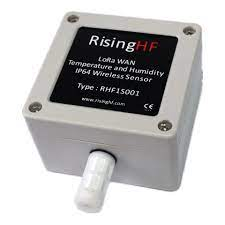
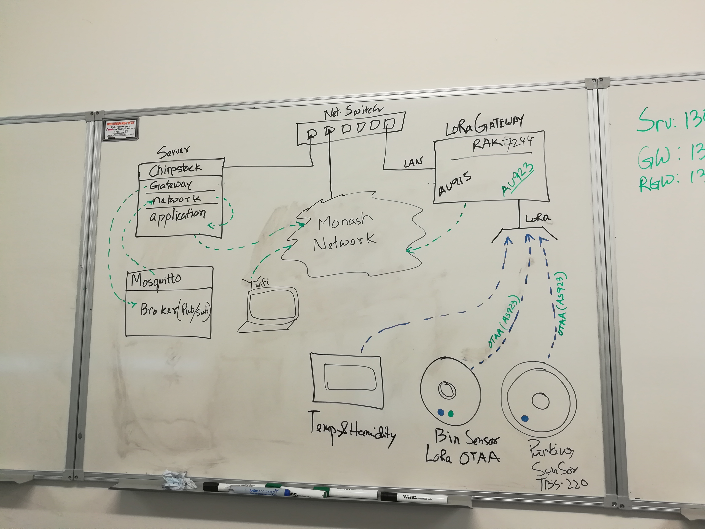

# LoRaWAN Docs

A LoRaWAN network was stablished to collect data from various LoRa supported devices in the lab environment in [HumaniSE lab](https://www.monash.edu/it/humanise-lab) at [Monash University](https://www.monash.edu) Clayton campus.

## List of softwares
- [Chirpstack](https://www.chirpstack.io/) open source software
- [ RAK7244](https://lora-alliance.org/lora_products/rak7244-lpwan-developer-gateway/) LoRaWAN gateway  
- [Mosquitto](https://mosquitto.org/) open source MQTT broker.
- [Redis](https://redis.io/) open source key value pair database server.
- [Grafana](https://grafana.com/) community edition to visualize the sensors data.
- [PostgreSQL](https://www.postgresql.org/) open source database.
## List of hardwares
- [RHS1S001](https://www.elecomes.com/products/risinghf-rhf1s001-wireless-lora-wan-temperature-and-humidity-sensor?variant=20142009122914) Temperature & Humidity device.

- [TBS220](https://www.thethingsnetwork.org/marketplace/product/tbs-220) parking sensor.

  

- [PCR2](https://www.parametric.ch/products/pcr2-in/) People counter sensor.

- [DF702](https://www.elecomes.com/products/df702-2meter-dingtek-waste-bin-detector-for-waste-management-2-meter-version?variant=20400197369954) Smart Bin sensor.

  
- HP Z2 PC was used a server with 12 Cores Intel Core i5 processor and 32GB RAM.

## Open source software developed
- [Taatta](https://www.github.com/whilemind/taatta) sensor data logger.
- [WQM101](https://www.github.com/whilemind/wqm101) water quality monitoring device.
- Smart City web client.

## Server used.
- Ubuntu Server 20.04.3 LTS (Focal Fossa)

## Band used.
- AS923

## Network
Here is the network diagram at the early stage.

## Some Issues faced:
- In order to configure RHF1S001 device I need to manage a window 7 laptop because the device driver of this device was not working on Window 10.

- ChirpStack Network configuration file must have the perfect configuration of Band of LoRa, otherwise you will not get data from device. But you may get REQ, ACCEPT message.

- Failed to add the repository of ChirpStack then downloaded the deb package and install manually.