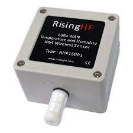

# Configure Temperature and Humidity Sensor RFH1S001

## Configuration
This device support to change the configuration of it. There has a specific tools that you need to install to connect and give command to change the configuration of this device. Like AppEUI, AppKey etc. It supports both ABP and OTTA.

## Tools setup
- The tools that has been provied by the vendor only support the Windows 7 because of the driver. I tried the driver and software in Windows 10 and it was not working.

## Bugs
- The payload that was received not decrypted properly although the product documentation was followed includig the TheThinkNetwork github branch.

